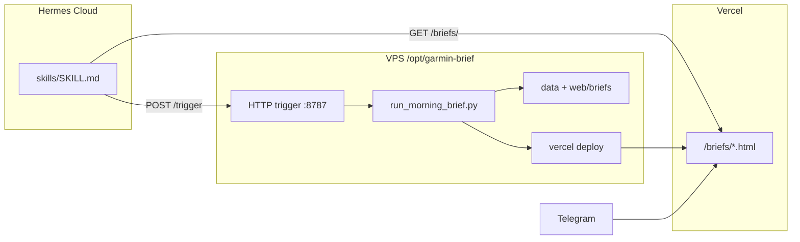

# Архитектура garmin-brief

Три площадки, одна ответственность у каждой.



## Роли

| Площадка | Что делает | Что не делает |
|----------|------------|---------------|
| **VPS** | Garmin, LLM, HTTP trigger, `.env`, SQLite, `vercel deploy` | Не отдаёт HTML пользователям (режим vercel) |
| **Vercel** | HTTPS, архив брифов, навигация по датам | Не запускает Python, нет секретов |
| **Hermes Cloud** | Skill, запуск через webhook, чтение URL | Не хранит prod `.env` |

## Запуск брифа

| Сценарий | Механизм |
|----------|----------|
| «Запусти сейчас» / утро | Hermes → `POST /trigger` на VPS |
| Отладка на VPS | SSH → `scripts/run_morning_brief.py` |
| Посмотреть старый бриф | GET Vercel `/briefs/` или `/briefs/YYYY-MM-DD.html` |

## HTTP trigger

```bash
# Health (без auth)
curl http://VPS:8787/health

# Запуск брифа (Hermes Cloud)
curl -X POST http://VPS:8787/trigger \
  -H "Authorization: Bearer $TRIGGER_SECRET" \
  -H "Content-Type: application/json" \
  -d '{"force": true, "attempt": 7}'

# Статус последнего job
curl http://VPS:8787/status -H "Authorization: Bearer $TRIGGER_SECRET"
```

Systemd: `hermes-brief-trigger.service` (ставится при `TRIGGER_SECRET` в `.env`).

## Безопасность

- `TRIGGER_SECRET` — только на VPS
- Endpoint запускает **только** `run_morning_brief.py`, не произвольный shell
- Лог: `data/trigger.log`
- Firewall: `ufw allow 8787/tcp` или Cloudflare Tunnel

## Зависимости Python

Зафиксировано: `garminconnect==0.2.8` (API с `.garth`). Не обновлять до 0.3.x без переписывания [`auth.py`](../src/hermes/garmin/auth.py).
